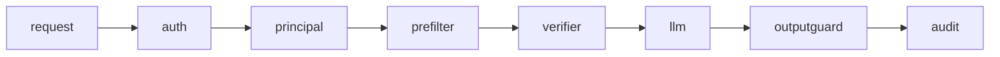

# GateKeep RAG

GateKeep is a permission-aware, multi-tenant RAG service. Every chunk carries tenant and ACL metadata; retrieval is filtered before the LLM; and an append-only hash chain records access. The core invariant is that a user from tenant A cannot retrieve, cite, or influence an answer with tenant B content.



## Quickstart

```powershell
python -m pip install -e ".[test]"
Copy-Item .env.example .env
docker compose up --build -d
docker compose exec api alembic upgrade head
docker compose exec api python -m pytest -q
python scripts/attack_demo.py
```

Demo users: `bob`/`bob` (Acme HR), `dave`/`dave` (Acme employee), and `frank`/`frank` (Globex admin). Production compose uses PostgreSQL, Alembic, and Qdrant when `.env` selects `PERSISTENCE_BACKEND=postgres` and `VECTOR_BACKEND=qdrant`. Unit tests use the in-memory doubles. Run `make real-test` after Docker services and migrations are available; it verifies real Qdrant tenant isolation and the PostgreSQL audit immutability trigger.

## Results

| Check | Result |
| --- | ---: |
| Tests | 14 passed |
| Isolation leak rate | 0.0 in security matrix |
| Permission decision coverage | unit + integration |
| Audit tamper detection | verified |

## Security model

Pre-filtering, post-retrieval ACL verification, tenant-checked prompt assembly, citation output filtering, identity freshness checks, and audit hash chaining work together. Retrieved documents are untrusted input, so prompt instructions inside them cannot grant access.

## Limitations and roadmap

The default unit-test path uses doubles; live adapter validation requires Docker. Database-backed auth/audit dependency wiring and distributed rate-limit dependency wiring remain follow-up work. Side channels and embedding inversion need additional operational controls. Roadmap: OIDC/SSO, SCIM, OPA/Cedar policy support, per-tenant encryption keys, and document versioning.

## Resume bullets

- Built a multi-tenant RAG service with role-based retrieval filtering and audit logging, preventing cross-tenant data leakage by design.
- Designed tenant-scoped vector retrieval with ACL pre-filters, defense-in-depth verification, guarded citations, and tamper-evident audit trails.
- Implemented security tests covering tenant isolation, role enforcement, request tampering, prompt injection boundaries, and audit integrity.
