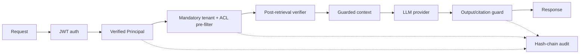

# Architecture

Every chunk carries tenant, roles/users, sensitivity, source, and content hash metadata. The pure `can_access` function and scoped retriever provide the application boundary; a Qdrant adapter can serialize the same filter for pre-filtering.
